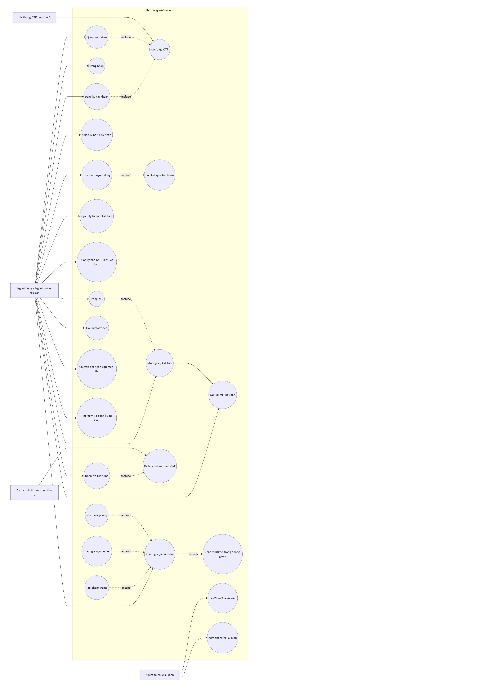
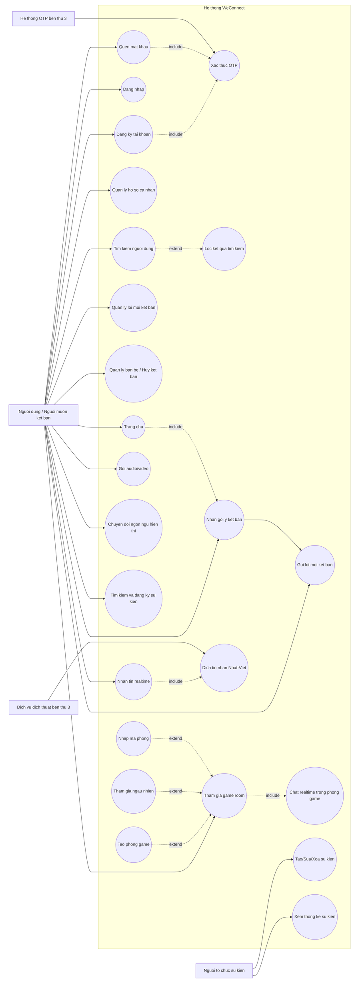

# Use Case Diagram - WeConnect

Biểu đồ dưới đây được tổng hợp từ tài liệu SRS WeConnect (các yêu cầu chức năng ID 3-18), tập trung vào các tương tác chính giữa actor và hệ thống.

## Ghi chu

- Actor chinh: Nguoi dung / Nguoi muon ket ban, Nguoi to chuc su kien.
- OTP la buoc bat buoc (include) cho Dang ky va Quen mat khau.
- Dang nhap khong include OTP theo SRS hien tai.
- Nhan goi y ket ban duoc the hien la include tu Trang chu.
- Precondition cho Nhan tin: hai ben phai la ban be (dependency, ghi chu - khong phai mui ten tu Nhan tin sang Quan ly ban be).
- Game room duoc chi tiet hoa thanh 3 cach vao phong: Tao phong, Tham gia ngau nhien, Nhap ma phong.
