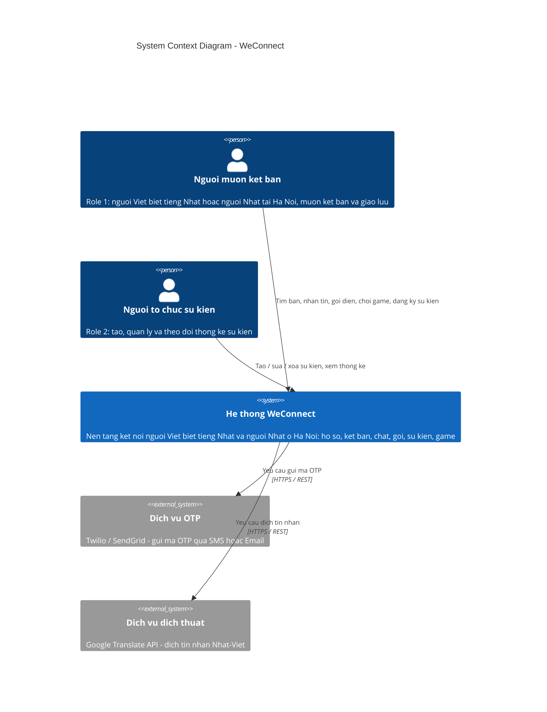
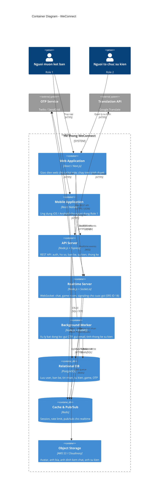

# C4 Architecture Diagram - WeConnect

Tài liệu kiến trúc theo mô hình [C4 Model](https://c4model.com/) gồm 2 mức:
- **Level 1 — System Context**: bối cảnh hệ thống, actors và hệ thống ngoài.
- **Level 2 — Container**: các container (web/mobile/backend/db/cache...) bên trong hệ thống và cách chúng giao tiếp.

---

## 1. C4 Level 1 — System Context

Mức cao nhất: WeConnect tương tác với những actor nào và phụ thuộc vào những hệ thống ngoài nào.

### Thành phần ở Level 1

| Thành phần | Loại | Mô tả |
|------------|------|-------|
| **Người muốn kết bạn** (Role 1) | Actor (Person) | Người dùng cuối — sử dụng các tính năng kết bạn, chat, sự kiện, game (SRS mục 1.3) |
| **Người tổ chức sự kiện** (Role 2) | Actor (Person) | Tạo và quản lý sự kiện, xem thống kê (SRS ID 7) |
| **WeConnect** | System | Hệ thống chính cần xây dựng |
| **Dịch vụ OTP** | System ngoài | Cung cấp OTP cho đăng ký & quên mật khẩu (SRS ID 3, 5, 8) |
| **Dịch vụ dịch thuật** | System ngoài | Dịch tin nhắn Nhật ↔ Việt khi user nhấn nút dịch (SRS ID 13, 8) |

---

## 2. C4 Level 2 — Container Diagram

Phóng to bên trong "He thong WeConnect": các container thực thi (deployable units) và đường dữ liệu giữa chúng.

### Thành phần ở Level 2

| Container | Tech (gợi ý) | Trách nhiệm | SRS ref |
|-----------|--------------|-------------|---------|
| **Web Application** | React / Next.js | Render UI, xử lý form, gọi REST + WebSocket | ID 2 |
| **Mobile Application** | React Native | App di động dùng chung backend với web | ID 2 |
| **API Server** | Node.js + Express | REST endpoints cho mọi feature trừ realtime | ID 2, 8 |
| **Realtime Server** | Socket.io | Chat realtime, game room, signaling cho call | ID 13, 17, 18 |
| **Background Worker** | BullMQ + Redis | Gửi OTP/email, tính thống kê sự kiện, xử lý job nặng | ID 7, 8 |
| **PostgreSQL** | RDBMS | Lưu trữ persistent data | ID 1 |
| **Redis** | Cache + Pub/Sub | Session, rate limit, broadcast realtime giữa các Realtime Server instance | ID 18 |
| **Object Storage** | S3 / Cloudinary | Lưu file media (avatar, ảnh chat, ảnh sự kiện) | ID 6, 13, 17 |
| **OTP Service** (ngoài) | Twilio / SendGrid | Gửi mã OTP qua SMS/email | ID 8 |
| **Translation API** (ngoài) | Google Translate | Dịch Nhật ↔ Việt | ID 8, 13 |

---

## 3. Các quyết định kiến trúc (ADR tóm tắt)

1. **Tách Realtime Server khỏi API Server**
   - Lý do: chat/call/game room cần kết nối WebSocket dài hạn, scale khác với REST stateless. SRS ID 18 yêu cầu auto-reconnect và độ trễ thấp.

2. **Redis Pub/Sub cho fanout realtime**
   - Lý do: khi scale Realtime Server thành nhiều instance, cần Pub/Sub để broadcast tin nhắn giữa các kết nối ở các node khác nhau.

3. **Background Worker cho gửi OTP**
   - Lý do: gọi Twilio/SendGrid có độ trễ và có thể fail; đẩy ra worker async để không block luồng đăng ký.

4. **Cache `translatedContent` trong DB**
   - Lý do: tránh gọi Google Translate nhiều lần cho cùng một tin nhắn (tiết kiệm cost + giảm độ trễ ID 13).

5. **Object Storage tách rời PostgreSQL**
   - Lý do: ảnh/video lớn không nên lưu trong RDBMS; CDN-friendly.

---

## 4. Phạm vi không bao gồm (out of scope)

- **C4 Level 3 (Component)** và **Level 4 (Code)**: chưa cần thiết ở pha thiết kế tổng quan.
- **CI/CD pipeline, monitoring, logging stack**: nên tách thành tài liệu DevOps riêng.
- **Bảo mật chi tiết** (WAF, secret management): nên tách thành tài liệu Security riêng.
