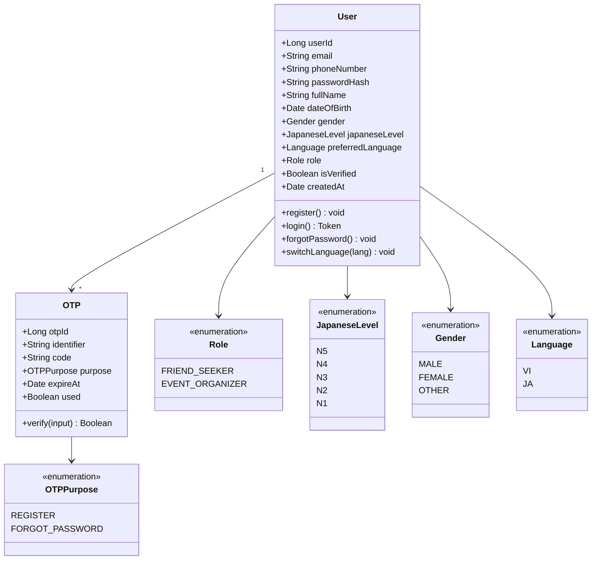
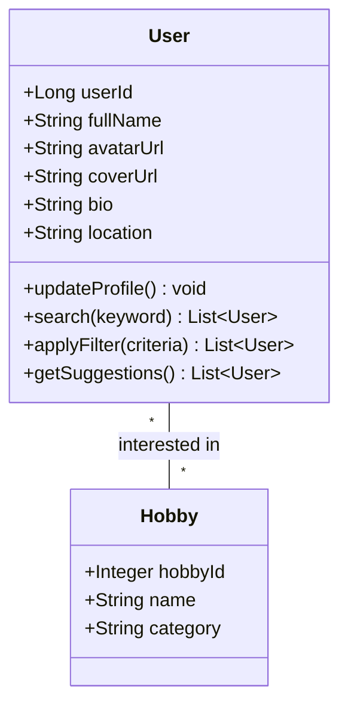
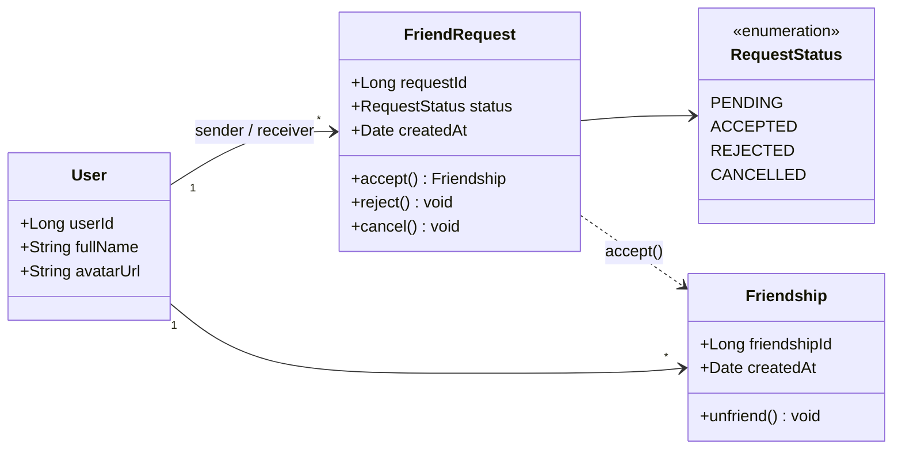
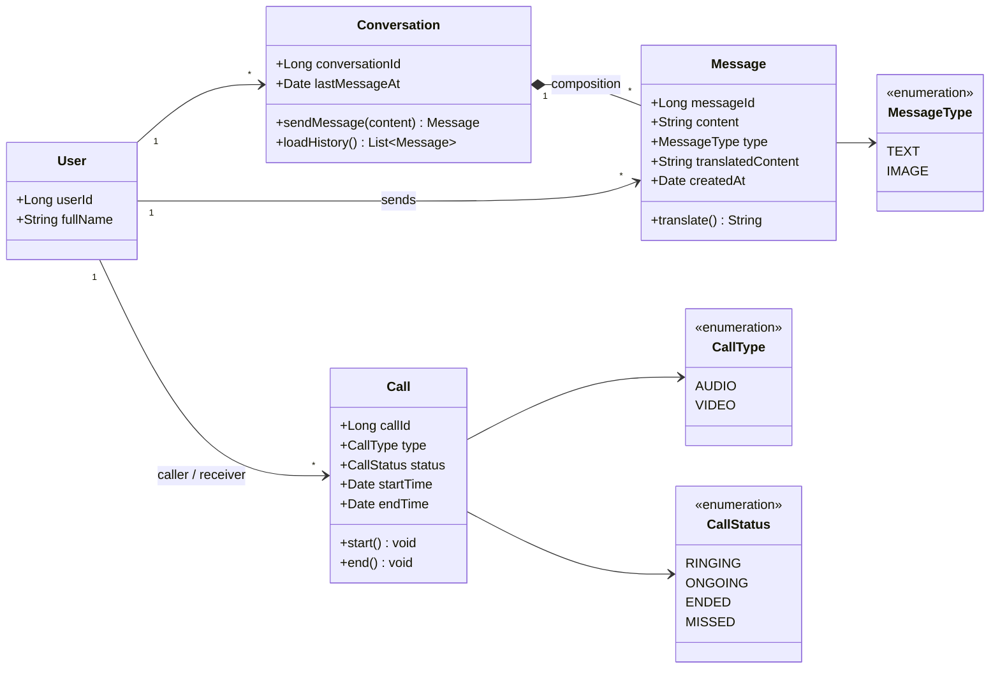
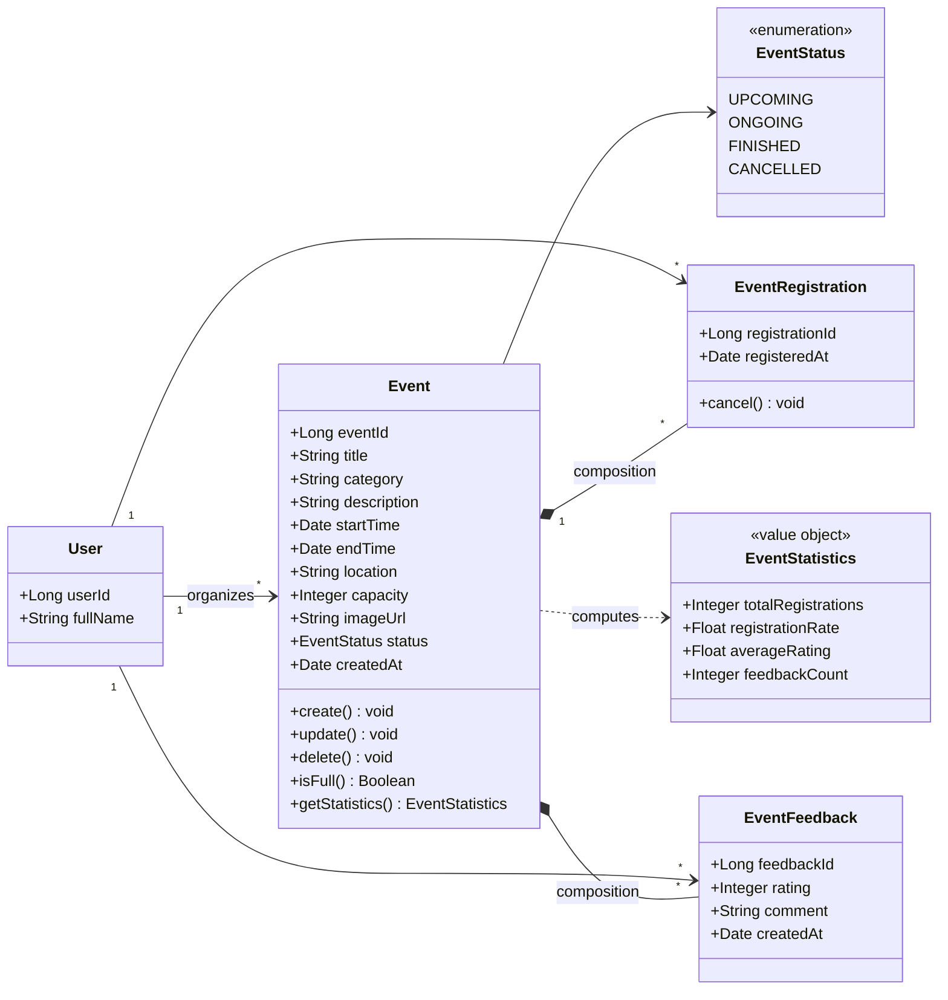
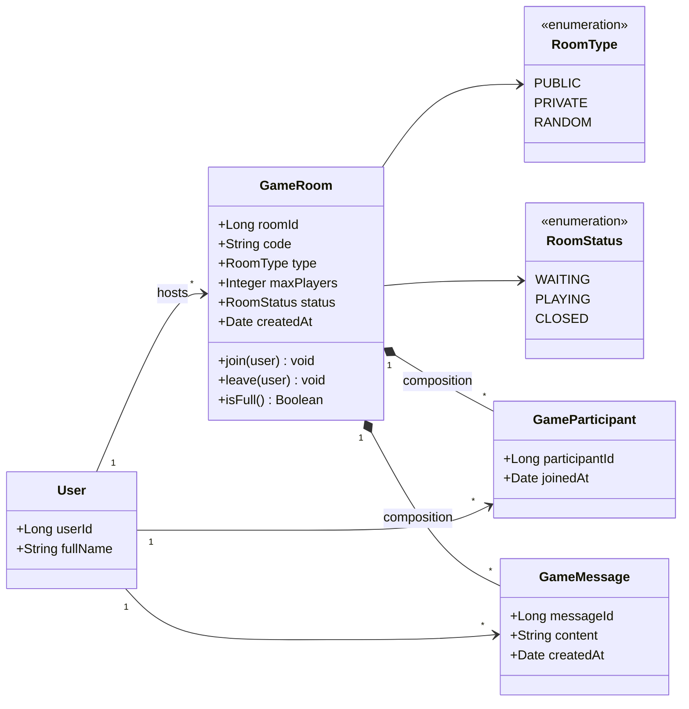
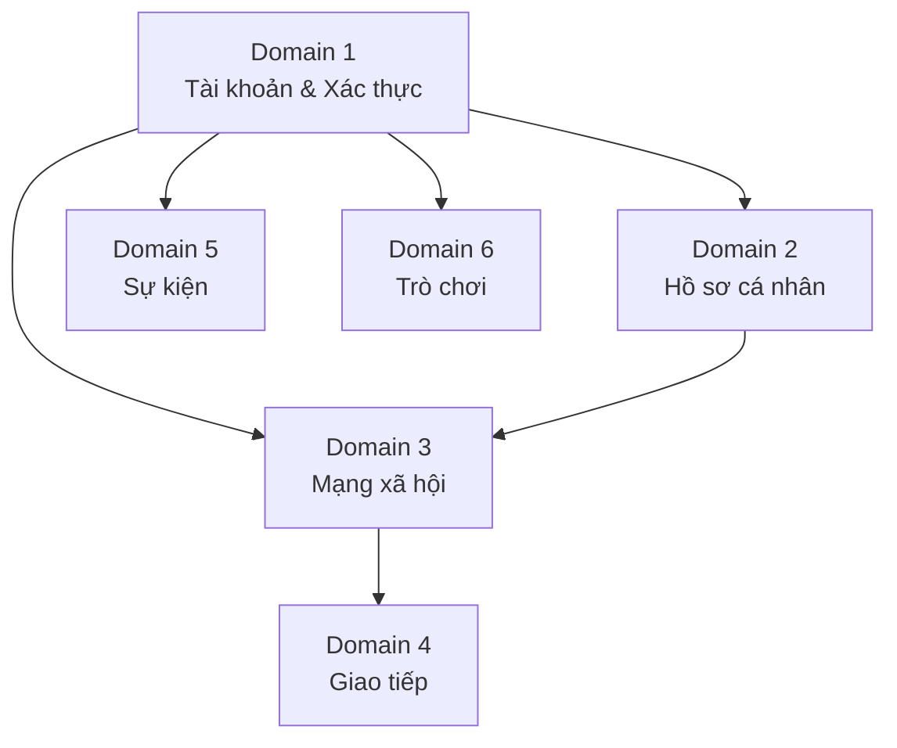

# Class Diagram - WeConnect (Tách theo Domain)

Bản tách các sơ đồ lớp theo từng domain nghiệp vụ, phục vụ thiết kế module hóa và đọc hiểu chi tiết.

> **Xem bản tổng quan:** [CLASS_DIAGRAM.md](CLASS_DIAGRAM.md)

---

## Domain 1 — Tài khoản & Xác thực
> SRS ID: 3, 4, 5, 14

**Phạm vi:** Đăng ký, đăng nhập, quên mật khẩu, xác thực OTP, đổi ngôn ngữ.

**Điểm chú ý:**
- `OTP` là entity độc lập với vòng đời riêng (tạo → xác minh → hết hạn/đã dùng).
- `User.preferredLanguage` được lưu để giữ ngôn ngữ qua các phiên (ID 14).
- `Role` phân loại người dùng: tìm bạn hoặc tổ chức sự kiện.

---

## Domain 2 — Hồ sơ cá nhân & Tìm kiếm
> SRS ID: 6, 15, 16

**Phạm vi:** Cập nhật hồ sơ, quản lý sở thích, tìm kiếm & lọc người dùng, gợi ý kết bạn.

**Điểm chú ý:**
- Quan hệ `User ↔ Hobby` là Many-to-Many, dùng làm tiêu chí lọc và gợi ý bạn (ID 15, 16).
- `getSuggestions()` tổng hợp từ sở thích, trình độ tiếng Nhật, và vị trí địa lý.

---

## Domain 3 — Mạng xã hội (Kết bạn)
> SRS ID: 9, 10, 11, 12

**Phạm vi:** Gửi/nhận/chấp nhận/từ chối lời mời kết bạn, hủy kết bạn, xem danh sách bạn bè.

**Điểm chú ý:**
- `FriendRequest` lưu cả sender và receiver (phân biệt qua FK trong DB).
- `Friendship` là điều kiện tiên quyết để bắt đầu chat (Domain 4).
- Trạng thái `CANCELLED` cho phép người gửi hủy lời mời trước khi được chấp nhận.

---

## Domain 4 — Giao tiếp (Chat & Gọi điện)
> SRS ID: 13

**Phạm vi:** Nhắn tin văn bản/hình ảnh, dịch tin nhắn, gọi audio/video.

**Điểm chú ý:**
- `Conversation` hiện là 1-1 (SRS ID 13), có thể mở rộng sang nhóm bằng cách tách `ConversationParticipant`.
- `Message.translatedContent` cache kết quả dịch, tránh gọi lại translation API (ID 8, 13).
- `Call` độc lập với `Conversation`: gọi không cần qua cửa sổ chat.

---

## Domain 5 — Sự kiện
> SRS ID: 7, 17

**Phạm vi:** Tạo/sửa/xóa sự kiện, đăng ký tham dự, phản hồi & thống kê sự kiện.

**Điểm chú ý:**
- `EventStatistics` là value object / DTO, không lưu DB, tính toán theo yêu cầu (ID 7).
- `isFull()` kiểm tra `capacity` trước khi cho đăng ký (ID 17).
- Chỉ `EVENT_ORGANIZER` mới có thể tạo/sửa/xóa sự kiện.

---

## Domain 6 — Trò chơi
> SRS ID: 17

**Phạm vi:** Tạo phòng, tham gia ngẫu nhiên, nhập mã phòng, chat trong phòng.

**Điểm chú ý:**
- `GameRoom.code` là unique, hỗ trợ chức năng "Nhập mã phòng" (ID 17).
- `RoomType.RANDOM`: hệ thống tự ghép người chơi ngẫu nhiên.
- `RoomType.PRIVATE`: chỉ người có mã mới tham gia được.

---

## Tóm tắt phụ thuộc giữa các domain

| Domain | Phụ thuộc vào |
|--------|---------------|
| Hồ sơ cá nhân | Tài khoản & Xác thực |
| Mạng xã hội | Tài khoản + Hồ sơ |
| Giao tiếp | Mạng xã hội (yêu cầu Friendship) |
| Sự kiện | Tài khoản (yêu cầu Role = EVENT_ORGANIZER) |
| Trò chơi | Tài khoản |
