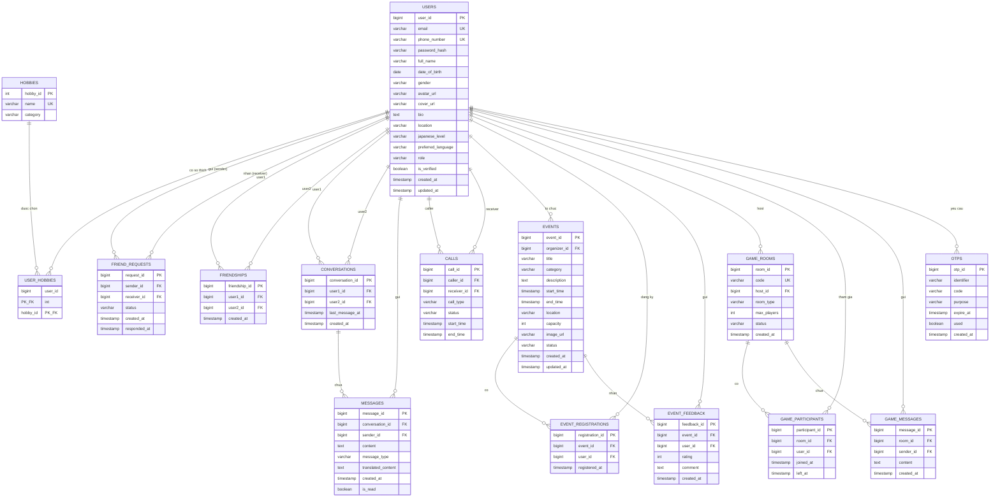

# ER Diagram - WeConnect

Sơ đồ thực thể-quan hệ của hệ thống WeConnect, được thiết kế từ tài liệu SRS (yêu cầu chức năng ID 1, 3–7, 9–17). Tương ứng với SRS ID 1: "Sơ đồ ERD cho WeConnect (gồm các bảng User, Bạn bè, Tin nhắn, Sự kiện, Trò chơi)".

---

## 1. Sơ đồ ER tổng thể

---

## 2. Mô tả các bảng

| Bảng | Mục đích | SRS ID |
|------|----------|--------|
| `USERS` | Tài khoản người dùng (cả Role 1 và Role 2) | 3, 4, 5, 6, 14 |
| `HOBBIES` | Danh mục sở thích | 6, 15, 16 |
| `USER_HOBBIES` | Bảng nối M-N giữa user và sở thích | 6, 15, 16 |
| `FRIEND_REQUESTS` | Lời mời kết bạn (PENDING / ACCEPTED / REJECTED / CANCELLED) | 10, 11 |
| `FRIENDSHIPS` | Quan hệ bạn bè đã được xác lập | 12 |
| `CONVERSATIONS` | Cuộc trò chuyện 1-1 giữa hai user | 13 |
| `MESSAGES` | Tin nhắn trong cuộc trò chuyện | 13 |
| `CALLS` | Lịch sử cuộc gọi audio/video | 13 |
| `EVENTS` | Sự kiện do organizer tạo | 7, 17 |
| `EVENT_REGISTRATIONS` | Đăng ký tham gia sự kiện | 17 |
| `EVENT_FEEDBACK` | Đánh giá / phản hồi sự kiện (rating + comment) | 7 |
| `GAME_ROOMS` | Phòng game | 17 |
| `GAME_PARTICIPANTS` | Người chơi trong phòng | 17 |
| `GAME_MESSAGES` | Chat realtime trong phòng game | 17 |
| `OTPS` | Mã OTP tạm thời cho register / forgot password | 3, 5, 8 |

---

## 3. Ràng buộc & quy tắc nghiệp vụ

### Ràng buộc khoá chính / khoá ngoại

| Bảng | Ràng buộc | Lý do nghiệp vụ |
|------|-----------|-----------------|
| `USERS` | `email`, `phone_number` UNIQUE | Một user — một định danh (SRS ID 3) |
| `USER_HOBBIES` | Composite PK `(user_id, hobby_id)` | Tránh trùng lặp một sở thích cho cùng user |
| `FRIEND_REQUESTS` | UNIQUE `(sender_id, receiver_id)` khi `status = PENDING` | Không gửi lời mời trùng lặp |
| `FRIENDSHIPS` | UNIQUE `(LEAST(user1_id, user2_id), GREATEST(...))` + CHECK `user1_id <> user2_id` | Quan hệ bạn bè duy nhất, không tự kết bạn với chính mình |
| `CONVERSATIONS` | UNIQUE `(LEAST(user1_id, user2_id), GREATEST(...))` | Chỉ tồn tại một conversation giữa cùng cặp user |
| `EVENT_REGISTRATIONS` | UNIQUE `(event_id, user_id)` | Một user chỉ đăng ký một lần cho mỗi sự kiện |
| `EVENT_FEEDBACK` | UNIQUE `(event_id, user_id)` + CHECK `rating BETWEEN 1 AND 5` | Một feedback mỗi user mỗi sự kiện, rating hợp lệ |
| `GAME_ROOMS` | `code` UNIQUE | Phục vụ chức năng "Nhập mã phòng" (SRS ID 17) |
| `GAME_PARTICIPANTS` | UNIQUE `(room_id, user_id)` khi `left_at IS NULL` | Một user không thể tham gia cùng phòng 2 lần |

### Logic ứng dụng (không phải DB constraint)

- **Chat precondition** (SRS ID 13): chỉ insert vào `MESSAGES` khi tồn tại `FRIENDSHIPS` giữa `sender_id` và `receiver` của conversation.
- **Event capacity** (SRS ID 17): trước khi insert `EVENT_REGISTRATIONS`, đếm `COUNT(*) WHERE event_id = ?` và so với `EVENTS.capacity` → nếu đầy thì hiển thị "Hết chỗ".
- **OTP expire**: kiểm tra `expire_at > NOW()` và `used = false` trước khi xác thực.

---

## 4. Index gợi ý (cho hiệu năng)

| Bảng | Index | Mục đích |
|------|-------|----------|
| `USERS` | `(email)`, `(phone_number)` | Login, kiểm tra trùng |
| `USERS` | `(role)`, `(japanese_level)` | Lọc & gợi ý kết bạn (SRS ID 15, 16) |
| `MESSAGES` | `(conversation_id, created_at DESC)` | Load lịch sử chat phân trang |
| `FRIEND_REQUESTS` | `(receiver_id, status)` | Load danh sách lời mời đến |
| `FRIENDSHIPS` | `(user1_id)`, `(user2_id)` | Load danh sách bạn bè |
| `EVENTS` | `(start_time)`, `(status)` | Liệt kê sự kiện sắp tới |
| `EVENT_REGISTRATIONS` | `(event_id)`, `(user_id)` | Đếm số đăng ký, lịch sử của user |
| `GAME_ROOMS` | `(code)`, `(status)` | Tìm phòng theo mã, lọc phòng đang waiting |
| `OTPS` | `(identifier, code, used)` | Verify OTP nhanh |

---

## 5. Lưu ý thiết kế

- **Bảng `FRIENDSHIPS` lưu một dòng duy nhất** cho mỗi cặp bạn (theo quy ước `user1_id < user2_id`). Tránh duplicate `(A,B)` và `(B,A)`.
- **Soft delete vs hard delete**: với `MESSAGES` nên dùng soft delete (thêm cột `deleted_at`) để giữ lịch sử cho audit. Hiện sơ đồ chưa thêm để gọn — bổ sung sau khi cần.
- **`translated_content`** lưu cache kết quả dịch để giảm gọi API (SRS ID 8, 13).
- **`OTPS.identifier`** lưu email hoặc phone (không phải `user_id`) vì lúc forgot password user chưa đăng nhập, lúc register chưa có `user_id`.
- **Bảng `EVENT_STATISTICS` không có**: thống kê (số đăng ký, average rating) được tính bằng `COUNT/AVG` từ `EVENT_REGISTRATIONS` và `EVENT_FEEDBACK` để luôn cập nhật real-time (SRS ID 7). Nếu performance kém, có thể thêm materialized view.

---

## 6. Ngoài phạm vi

Các bảng chưa thiết kế trong sơ đồ này (có thể bổ sung sau khi nghiệp vụ rõ hơn):

- `NOTIFICATIONS`: thông báo trong app (SRS không yêu cầu rõ).
- `BLOCKED_USERS`: chặn người dùng (SRS không đề cập).
- `REPORTS`: báo cáo vi phạm (SRS không đề cập).
- `SESSIONS` / `REFRESH_TOKENS`: tuỳ chiến lược auth (JWT stateless thì không cần).
