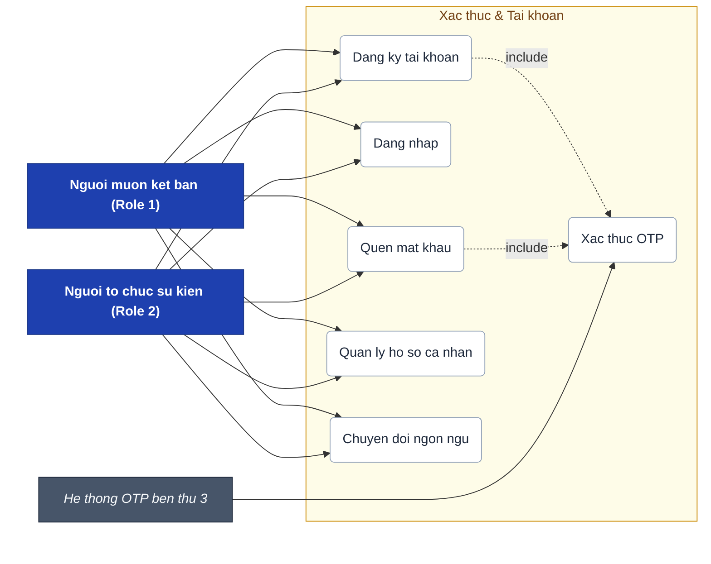
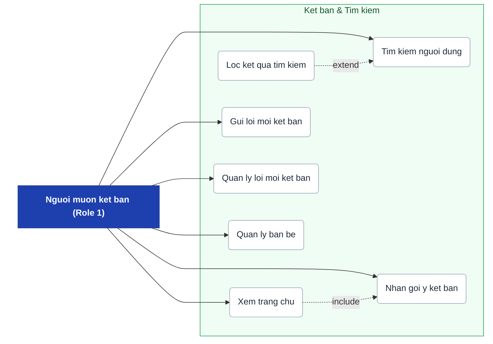
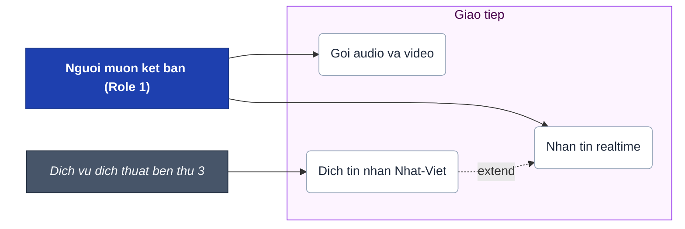
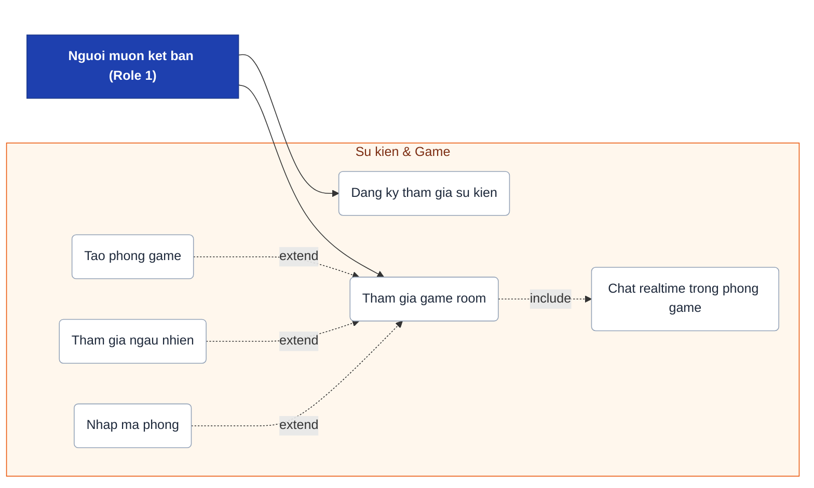
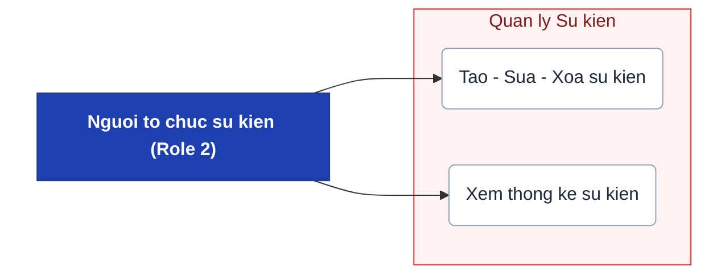

# Use Case Diagram - WeConnect

Biểu đồ tổng hợp từ tài liệu SRS WeConnect (các yêu cầu chức năng ID 3–7, 9–17), được tách thành **5 biểu đồ con** theo nhóm chức năng.

---

## 1. Xác thực & Tài khoản (SRS ID: 3, 4, 5, 6, 14)

---

## 2. Kết bạn & Tìm kiếm (SRS ID: 9, 10, 11, 12, 15, 16)

---

## 3. Giao tiếp (SRS ID: 13)

> **Precondition**: `Nhan tin realtime` yeu cau hai ben phai la ban be (SRS ID 13).

---

## 4. Sự kiện & Game (SRS ID: 17)

---

## 5. Quản lý Sự kiện (SRS ID: 7)

---

## Ghi chú chung

- **Actors**:
  - `Nguoi muon ket ban` (Role 1): ket ban, nhan tin, goi dien, dang ky su kien, choi game.
  - `Nguoi to chuc su kien` (Role 2): quan ly & thong ke su kien. Ca hai role deu dung chung cac UC xac thuc & tai khoan.
  - `He thong OTP` / `Dich vu dich thuat`: he thong ngoai cung cap dich vu (tich hop API ben thu 3).

- **Nhom UC (mau sac)**:

  | Mau | Nhom | SRS ID |
  |-----|------|--------|
  | Vang | Xac thuc & Tai khoan | 3, 4, 5, 6, 14 |
  | Xanh la | Ket ban & Tim kiem | 9, 10, 11, 12, 15, 16 |
  | Tim | Giao tiep | 13 |
  | Cam | Su kien & Game | 17 |
  | Do | Quan ly su kien | 7 |

- **Quan he include** (bat buoc thuc hien):
  - `Dang ky` va `Quen mat khau` bat buoc qua `Xac thuc OTP`.
  - `Xem trang chu` luon hien thi `Nhan goi y ket ban`.
  - `Tham gia game room` luon co `Chat realtime trong phong`.

- **Quan he extend** (tuy chon, co dieu kien):
  - `Loc ket qua` extends `Tim kiem`: chi khi nguoi dung ap dung bo loc.
  - `Dich tin nhan` extends `Nhan tin`: chi khi nhan nut dich (SRS ID 13).
  - `Tao phong`, `Tham gia ngau nhien`, `Nhap ma phong` la 3 cach mo rong cua `Tham gia game room`.

- **Ngoai pham vi**: UC ha tang ky thuat (ID 1 - CSDL, ID 2 - Moi truong, ID 8 - API, ID 18 - WebSocket) khong xuat hien vi khong phai tuong tac actor-he thong.
